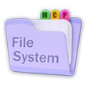

EADME_fixed.md</path>
<content"># Rust MCP Filesystem

  

Rust MCP Filesystem is a blazingly fast, asynchronous, and lightweight MCP (Model Context Protocol) server designed for efficient handling of various filesystem operations.
This project is a pure Rust rewrite of the JavaScript-based `@modelcontextprotocol/server-filesystem`, offering enhanced capabilities, improved performance, and a robust feature set tailored for modern filesystem interactions.

🚀 Refer to the [project documentation](https://rust-mcp-stack.github.io/rust-mcp-filesystem) for installation and configuration instructions.

## ⚡ Performance Features

This Rust implementation includes ultra-advanced performance optimizations not available in the JavaScript version:

### 🚀 Hardware Acceleration

- **SIMD Operations**: AVX2/SSE4.2 optimized code analysis for x86_64 systems
- **Hardware Detection**: Automatic detection and utilization of available CPU features
- **Adaptive Optimization**: Dynamic optimization based on system capabilities

### 💾 Memory Optimization

- **Memory Mapping**: Zero-copy file operations using `memmap2` for large files
- **LZ4 Compression**: Bandwidth optimization for network transfers
- **Intelligent Caching**: Smart memory management for repeated operations

### ⚡ Parallel Processing

- **Rayon Integration**: Parallel file processing for directory operations
- **Async I/O**: Tokio-powered asynchronous operations for scalability
- **Concurrent Operations**: Multi-threaded performance for large workloads

### 📊 Performance Monitoring

- **Real-time Metrics**: Built-in performance monitoring and metrics collection
- **Benchmark Suite**: Comprehensive benchmarking tools for performance validation
- **Configuration Tuning**: Environment-based performance configuration

## Features

- **⚡ Ultra-High Performance**: Built in Rust with SIMD optimizations, memory mapping, and parallel processing
- **🔒 Read-Only by Default**: Starts with no write access, ensuring safety until explicitly configured otherwise.
- **🔍 Advanced Glob Search**: Supports full glob pattern matching allowing precise filtering of files and directories using standard glob syntax.For example, patterns like `*.rs`, `src/**/*.txt`, and `logs/error-???.log` are valid and can be used to match specific file types, recursive directory searches, or patterned filenames.
- **📁 Nested Directories**: Improved directory creation, allowing the creation of nested directories.
- **📦 Lightweight**: Standalone with no external dependencies (e.g., no Node.js, Python etc required), compiled to a single binary with a minimal resource footprint, ideal for both lightweight and extensive deployment scenarios.
- **🧠 Intelligent Code Analysis**: Advanced code definition extraction with hardware acceleration for Rust projects
- **📊 Performance Monitoring**: Real-time metrics and performance insights
- **🔧 Configurable Optimization**: Environment-based tuning for different use cases

#### 👉 Refer to [capabilities](https://rust-mcp-stack.github.io/rust-mcp-filesystem/#/capabilities) for a full list of tools and other capabilities.

## 🔧 Installation & Configuration

For detailed setup instructions, please visit the [project documentation](https://rust-mcp-stack.github.io/rust-mcp-filesystem).

## Purpose

This project aims to provide a reliable, secure, and feature-rich MCP server for filesystem management, reimagining the capabilities of @modelcontextprotocol/server-filesystem in a more performant and type-safe language. Whether you're building tools for file exploration, automation, or system integration, rust-mcp-filesystem offers a solid foundation.

## 🧰 Built With

The project leverages the [rust-mcp-sdk](https://github.com/rust-mcp-stack/rust-mcp-sdk) and [rust-mcp-schema](https://github.com/rust-mcp-stack/rust-mcp-schema) to build this server. check out those repositories if you're interested in crafting your own Rust-based MCP project or converting existing ones to Rust for enhanced performance and safety.

## License

This project is licensed under the MIT License. see the [LICENSE](LICENSE) file for details.

## Acknowledgments

Inspired by `@modelcontextprotocol/server-filesystem` and built with the power of Rust.